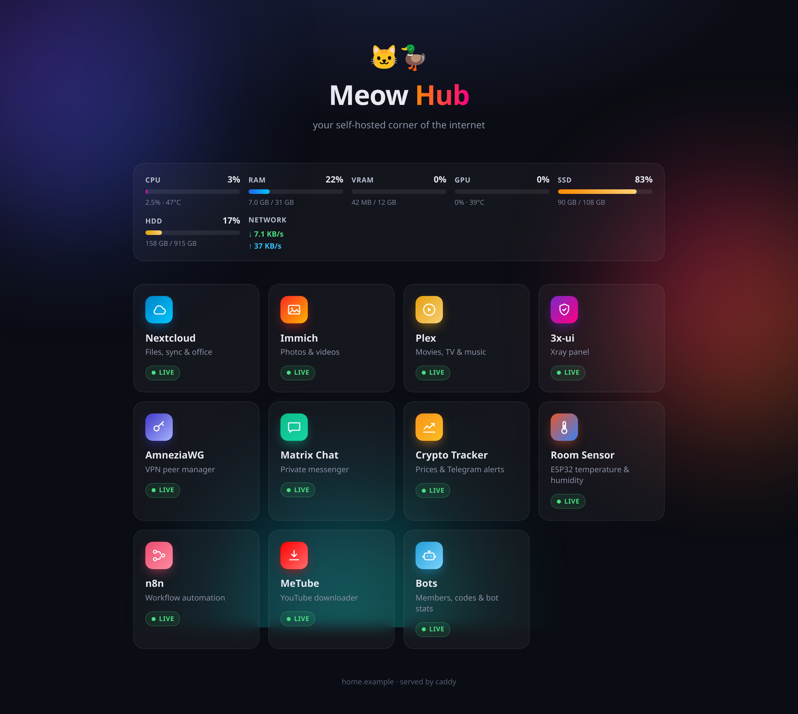
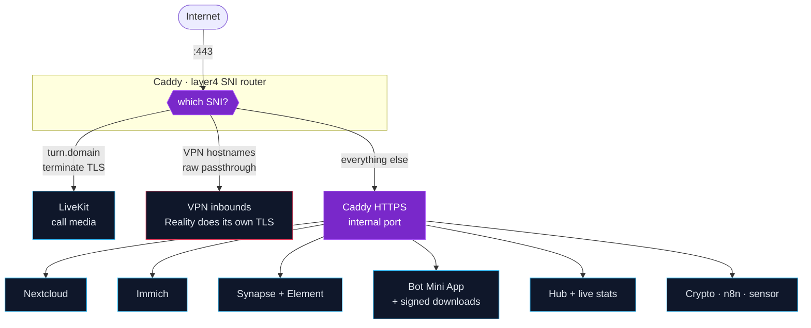
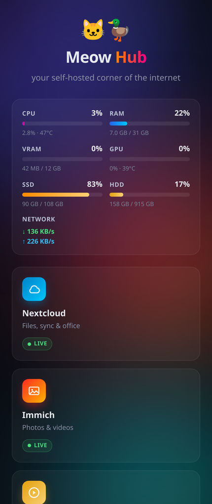
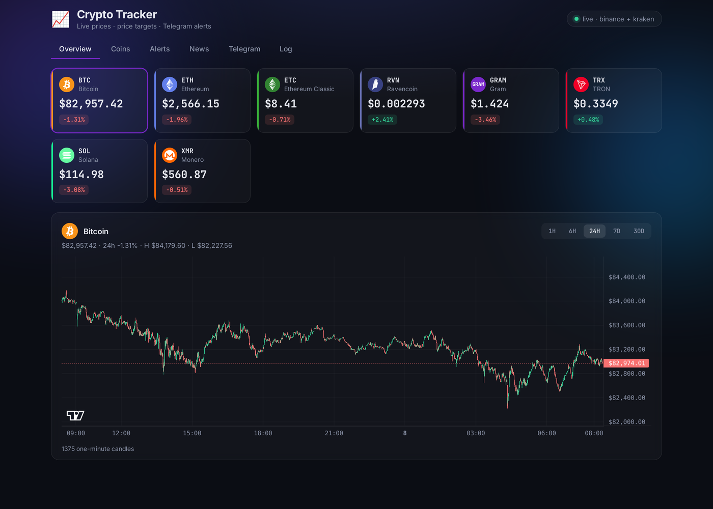
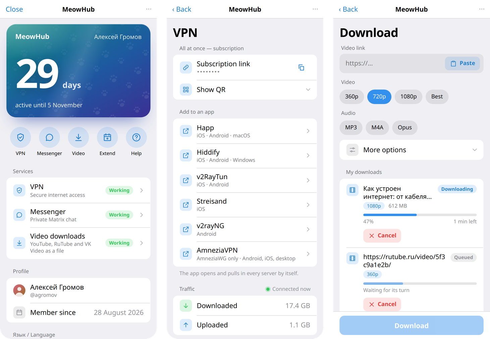
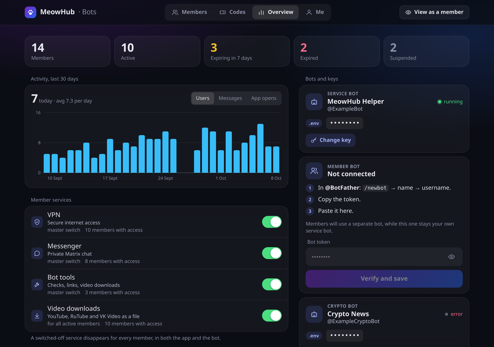

<div align="center">

# 🐱🦆 MeowHub

**Your self-hosted corner of the internet.**

Files, photos, private chat with voice and video, a media downloader, a live
dashboard, a Telegram bot that hands out access to all of it — and two VPN paths
for networks that don't want you to have any of it.

One `docker compose up`. One `.env`. One reverse proxy.




</div>

---

## What this is

A complete home server in one repository. Clone it, set two values, run one
script, and you get your own cloud — with real certificates, on your own domain,
on hardware you control.

|  | Service | Lives at |
|---|---|---|
| ☁️ | **Nextcloud** — files, sync, calendar, office | `cloud.yourdomain` |
| 🖼️ | **Immich** — photos and video, face recognition | `photos.yourdomain` |
| 💬 | **Matrix + Element** — private chat, voice, video | `matrix.yourdomain` |
| ⬇️ | **Downloader** — YouTube, RuTube and VK Video for every member, files self-delete after 30 min (MeTube + yt-dlp underneath) | Mini App |
| 📈 | **Crypto Tracker** — live prices, price and volatility alerts, breaking news from 11 sources | `yourdomain/<secret>` |
| 🔁 | **n8n** — workflow automation, optional local LLM | `yourdomain/<secret>` |
| 🌡️ | **Room Sensor** — charts from an ESP32 that posts from anywhere | `yourdomain/<secret>` |
| 📊 | **Hub page** — service cards + live CPU/RAM/GPU/disk/network | `yourdomain/<secret>` |
| 🤖 | **Helper bot** — health alerts for you; invite-code memberships (VPN, Matrix, downloads) for your people, with a Telegram Mini App in Russian or English | Telegram |
| 🛡️ | **AmneziaWG** — obfuscated WireGuard VPN | optional |
| 🚀 | **3x-ui** — VLESS/Reality, Hysteria2, Shadowsocks | optional |

## Quick start

```bash
git clone https://github.com/Qumetri/MeowHub.git && cd MeowHub
cp .env.example .env
$EDITOR .env          # set BASE_DOMAIN and ACME_EMAIL — that's all that's required
./bootstrap.sh
docker compose up -d
```

`bootstrap.sh` does the tedious parts: generates every password, randomises the
secret URLs, renders the config files for programs that can't read environment
variables, builds the Caddy image and the dashboard, and creates the directories.
It's safe to re-run — it never overwrites something you set.

Then open the URL it prints. Certificates are issued automatically.

> **Before you start:** point DNS at the server and make sure ports 80 and 443
> are reachable. Certificate issuance fails otherwise, and Let's Encrypt
> rate-limits retries. Full walkthrough in **[docs/DEPLOY.md](docs/DEPLOY.md)**.

## How the traffic flows

Port 443 carries three things that normally can't share a port: ordinary HTTPS,
TURN-over-TLS for calls, and VPN traffic that must *not* be decrypted. A custom
Caddy build with the layer4 module peeks at the SNI and routes accordingly.



Everything behind Caddy is on an internal Docker network. Nothing else is
exposed. Adding a service means adding a route, not opening a port.

## Pick what you run

<table>
<tr><td width="58%" valign="top">

Not everyone wants all of it. One line in `.env` decides:

```ini
# everything
COMPOSE_PROFILES=nextcloud,immich,matrix,metube,crypto,sensor,n8n,ollama,helper

# just files and photos
COMPOSE_PROFILES=nextcloud,immich

# a photo server and nothing else
COMPOSE_PROFILES=immich
```

| Profile | Services |
|---|---|
| `nextcloud` | 6 |
| `nextcloud,immich` | 10 |
| all nine | 24 |

Caddy's routes are **generated to match**, so a service you turned off leaves
no dead route behind — no 502s, no half-configured vhosts.

The dashboard is responsive, so the hub works from a phone as well as a desk.

</td><td width="42%" valign="top">



</td></tr>
</table>

## Everything is in one file

`.env` holds **128 settings**, each documented where it sits. Only two have no
sensible default, because they can't:

```ini
BASE_DOMAIN=example.com
ACME_EMAIL=you@example.com
```

Everything else already works: hostnames derive from your domain, images are
pinned to tested versions, ports and storage paths have defaults, and every
password is generated for you.

<details>
<summary><b>What's in there</b></summary>

| Group | Examples |
|---|---|
| Identity | `BASE_DOMAIN`, `CLOUD_HOST`, `MATRIX_HOST`, `ACME_EMAIL`, `TZ` |
| What runs | `COMPOSE_PROFILES`, `COMPOSE_FILE` (GPU overlay) |
| Storage | `DATA_ROOT` and per-service paths |
| Secret paths | `DASHBOARD_PATH`, `METUBE_PATH`, `MATRIXRTC_PATH`, `AWG_ADMIN_PATH`, `XHTTP_PATH`, `CRYPTO_PATH`, `SENSOR_PATH`, `N8N_PUBLIC_PATH`, `BOT_APP_PATH`, `BOT_ADMIN_PATH` |
| Ports | web, debug, call media, TURN relay range |
| Versions | every image tag, pinned |
| Secrets | 12 passwords and shared secrets, all generated |
| VPN | subnet, endpoint, MTU, port, SNI passthrough |
| Branding | `HUB_NAME`, `ELEMENT_BRAND` |

</details>

## Tracking crypto

Live prices, price targets and volatility alerts pushed to Telegram, with
candlestick charts on the page.



<table>
<tr><td width="55%" valign="top">

**You manage the coin list yourself.** The Coins tab takes a ticker (`XMR`) or a
full symbol (`SOLUSDT`), checks it against the exchanges, backfills its history
and joins it to the live stream — no restart, no config file. Removing a coin
takes its targets with it and says so first.

Ships tracking BTC, ETH, ETC, RVN, GRAM, TRX and SOL on Binance, plus XMR on
Kraken.

**Two exchanges, for a reason.** Binance is tried first because its backfill is
deeper; Kraken is the fallback for what Binance doesn't trade.

Monero is why. Binance halted `XMRUSDT` in February 2024, but still lists it —
and `/ticker/price` still answers, with the price it froze at: about **$118**,
while XMR actually trades near **$540**. So a symbol is only accepted if its
status is `TRADING`. Existence is not the same as being tradable.

**And checking once is not enough.** A pair can be halted long after you add it:
Toncoin rebranded to Gram and Binance halted every `TON*` pair on 30 June 2026,
serving a frozen $1.60 ever since. So every tracked coin is re-validated hourly.
A coin that stops trading is struck through on the page, marked in the **Feed**
column, and announced once over Telegram — because a frozen price is
indistinguishable from a quiet market, and silently-never-alerting is the worst
thing an alerting tool can do. Renamed coins get a **⇄** button that swaps in the
successor and carries your targets across.

</td><td width="45%" valign="top">

Alerts come in two kinds:

**Price targets** fire on a *crossing*, not a level. Add one the price has
already passed and it arms instead of firing immediately, then waits for a
genuine crossing. Both directions, because shorts matter as much as longs.

**Volatility alerts** fire on a 5% swing within an hour — rises and falls alike,
measured from the hour's low or high so a sharp V counts. Every further 5% alerts
again, and past 10% the alert is sent three times a minute apart with the live
price. With n8n, each move then gets a reply underneath: **why it moved**, citing
fresh news and the exchanges' own announcements — or saying plainly that there
is no news cause.

</td></tr>
</table>

**Breaking news, not just a morning digest.** A background watcher polls the
places coin-moving news appears first — Binance listing, delisting and upgrade
notices every 30 s, Upbit's warning lists, the Kraken and Coinbase status pages,
a Telegram news channel, and the OKX, Bybit, KuCoin and Bitget announcements —
without a single API key. The same story from five places becomes one item with
a "5 sources" note; each item is scored by keyword (a delisting 100, a hack 90,
regulators 70 …) and only what touches *your* coins and clears the threshold is
pushed, at most ten a day. Hacks and delistings ignore quiet hours. The **News**
tab shows every source's health and measured latency, so you can see which feeds
actually earn their place.

Coin logos are bundled (483 of them, CC0) rather than hot-linked, so the page
discloses nothing about what you track. Anything the pack predates falls back
to a coloured ticker badge.

Setup is four steps in the Telegram tab, including a **Detect chat** button so
you never hunt for a numeric chat ID. Full details in
**[docs/CRYPTO.md](docs/CRYPTO.md)**.

## Automating things

The `n8n` profile adds [n8n](https://n8n.io) on its own secret path — schedules
and webhooks wired to HTTP calls, models and notifications. Unlike the rest of
the secret-path services it is **not** behind basic auth: it has real accounts
of its own, with optional 2FA.

The `ollama` profile adds a local model runtime alongside it, reachable from
workflows as `http://ollama:11434` and **publishing no port at all** — an
unauthenticated model server has no business listening on the network. Add
`docker-compose.gpu.yml` to run it on an NVIDIA card; on a 12 GB card an 8B
model sits entirely in VRAM at around 60 tokens/s.

Two worked examples ship in the box: `crypto-daily-summary.json` explains
each coin's last 24 hours every morning, and `crypto-move-explainer.json`
answers every volatility alert with its likely cause.

Its design rule is worth stealing: **the model never supplies a number.** The
price table, the ranking and the averages are computed in a Code node and handed
to the model as settled facts, so the worst it can do is write a dull sentence —
not invent a price. Full details in **[docs/N8N.md](docs/N8N.md)**.

## A bot for the whole hub

The `helper` profile adds a Telegram bot. It **watches the server and messages
you when something breaks** — a full disk, a crash-looping container, an
expiring certificate, a GPU lost to a driver upgrade, or DNS no longer pointing
at your IP — and again when it's fixed. It also lists the hub's links and hands
**you, and only you**, the logins for your services, in a message that deletes
itself after a minute.



It can also **let other people in**. You mint an access code; whoever redeems it
becomes a member for 30 days (or as long as you choose) and gets, from a
Wallet-style Telegram Mini App:

- **VPN** — a personal, auto-updating subscription from your 3x-ui panel that
  opens straight in Happ, Hiddify, v2RayTun, Streisand or v2rayNG, plus one
  AmneziaWG peer each (one tap into AmneziaVPN on Android, a file elsewhere).
  Configs are grouped by the app they need, each with a one-line instruction.
  New inbounds reach every member by themselves.
- **Matrix** — an account on your homeserver, created in the app.
- **Downloads** — paste or share a YouTube, RuTube or VK Video link, pick 360p to
  1080p or MP3/M4A/Opus, add subtitles or a clip range, and save the file from a
  signed link. Every user gets their own folder and quotas; files delete
  themselves after 30 minutes, so a busy server doesn't fill up.

The bot reminds members 24 hours before their time runs out. When it does, the
VPN client is switched off and the Matrix accounts are locked (rooms and history
kept); a new code brings it all back. Every service has an **owner switch**, and a
new one starts off until you turn it on.

Everything — both bots and the app, your admin screens included — speaks
**Russian or English**: Auto follows each person's Telegram language, and `/lang`
or a switch in the app overrides it, for the bot and the app at once.



The owner's **Bots** page (on the hub, and inside the app) shows members, codes,
activity, downloads and every bot token — which you can swap from the page
without touching `.env` — and has a "view as a member" preview. An optional
second bot keeps your ops bot private while members talk to theirs.

Setup is two lines in `.env` — `HELPER_BOT_TOKEN` and your Telegram id as
`HELPER_OWNER_ID`; the VPN and Matrix halves of the memberships each need one
more value (a 3x-ui API token, a Matrix admin). Full details in
**[docs/HELPER.md](docs/HELPER.md)**.

## Movies and series into Plex

Nextcloud gets a **Plex** folder with `Movies`, `TV Shows` and `Anime` inside.
Move a file there from your phone or laptop, and a few seconds later it's in
Plex with poster, summary and cast. `scripts/plex-library.sh` sets up both sides
in one go. Naming rules and the anime caveats are in **[docs/PLEX.md](docs/PLEX.md)**.

## Requirements

- Linux, Docker Engine, Compose v2
- A domain with DNS pointing at the server
- Ports 80 and 443 open
- `gettext-base`, `openssl`, `python3` — and `npm` to build the dashboard
- ~4 GB RAM for everything, ~2 GB without Immich's ML

**GPU is optional.** The base stack requests no devices and runs anywhere. With
an NVIDIA card, add one line to `.env` for hardware transcoding and CUDA face
recognition:

```ini
COMPOSE_FILE=docker-compose.yml:docker-compose.gpu.yml
```

## Layout

```
.env                    every setting
bootstrap.sh            setup + re-render
docker-compose.yml      the stack        docker-compose.gpu.yml   NVIDIA overlay
caddy/                  custom image + Caddyfile template
dashboard/              hub page (Vite + React) — cards in src/services.js
stats/                  host metrics, dependency-free Python
crypto/                 crypto tracker + Telegram alerts (dependency-free Python)
sensor/data/            ESP32 sensor readings (the app is built from its own repo)
n8n/workflows/          importable automation workflows
helper/                 Telegram bots (dependency-free Python) + webapp/ Mini App (Vite + React)
matrix/                 Synapse · Element · coturn · LiveKit  (templates)
amneziawg/              obfuscated WireGuard      ⟵ separate compose project
3xpanel/                3x-ui panel               ⟵ separate compose project
docs/                   one file per component + research/ reports
```

The VPNs are **separate Compose projects on purpose**. `docker compose up -d` in
the main directory cannot recreate or destroy them, and vice versa.

## Documentation

| | |
|---|---|
| 🚀 **[DEPLOY.md](docs/DEPLOY.md)** | First deployment — host prep, DNS, router ports, permissions, migrating an existing install |
| 🔧 **[OPERATIONS.md](docs/OPERATIONS.md)** | Daily commands, backups, upgrade rules, and the failure modes worth knowing in advance |
| 🛡️ **[VPN.md](docs/VPN.md)** | Both VPN paths, obfuscation, handing out configs |
| 📈 **[CRYPTO.md](docs/CRYPTO.md)** | Price and volatility alerts, news digest, "why did it move", Telegram setup |
| 🌡️ **[SENSOR.md](docs/SENSOR.md)** | The ESP32 room sensor — posting from another network, token, certificate check, importing old readings |
| 🔁 **[N8N.md](docs/N8N.md)** | Automation, local models, the daily-summary and move-explainer workflows |
| 🤖 **[HELPER.md](docs/HELPER.md)** | The Telegram bots and Mini App — health alerts, memberships and codes, VPN by app, downloader, Russian/English |
| 🎬 **[PLEX.md](docs/PLEX.md)** | Movies, series and anime through Nextcloud into Plex — naming, metadata, anime caveats |
| 🔬 **[research/](docs/research/README.md)** | Dated research reports — censorship-resistant VPN transports, the multi-user downloader, fast crypto news sources, AmneziaVPN deep links — and the decisions taken from them |
| 🏗️ **[ARCHITECTURE.md](docs/ARCHITECTURE.md)** | Why it's built this way — mostly stories about what broke first |

## Security, honestly

The hub page has **no login**. Its URL prefix is the credential —
`bootstrap.sh` gives it a random suffix like `hub-a1b2c3d4e5f6`, and treating
that URL as a password is the whole security model. That's deliberate: it costs
nothing, and for a single-user service a login screen is friction nobody wants.

It is *not* appropriate for anything sensitive, which is why four pages sit
behind HTTP basic auth instead: the VPN peer manager, which hands out working
VPN keys, the crypto tracker, which stores a Telegram bot token and can
send messages as you, the helper bot's admin page, which manages who gets
VPN and chat accounts, and MeTube, whose API can queue and delete downloads and
upload cookies (it shares the bots admin login; members never use that route —
the bot talks to MeTube internally and hands files out through short-lived
HMAC-signed links, so the MeTube path never leaks). The bot's Mini App for
members has no basic auth: it accepts only Telegram's signed login data.

Nextcloud, Immich and Matrix have real authentication of their own.

Back up `.env`, `secrets/`, `matrix/synapse/signing.key` and `amneziawg/config/`.
The last two cannot be regenerated: lose the signing key and your homeserver's
identity is gone, lose the VPN config and every client key you handed out stops
working.
